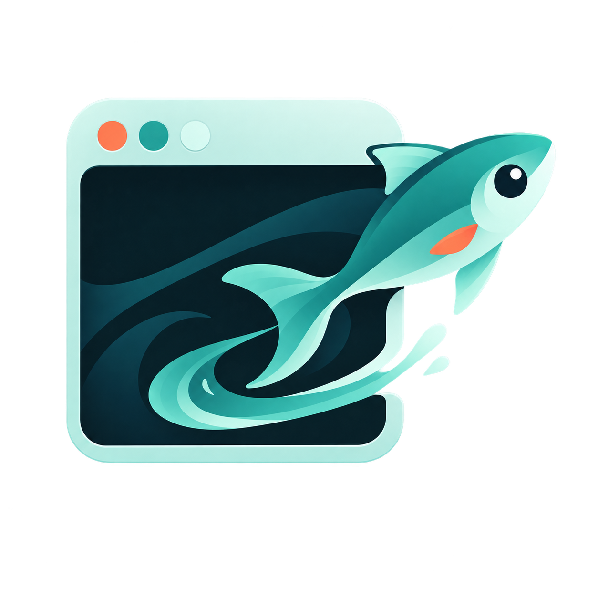
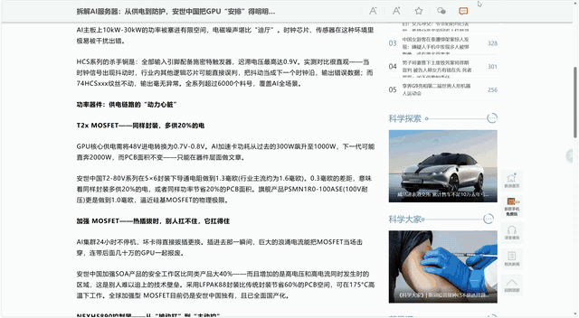
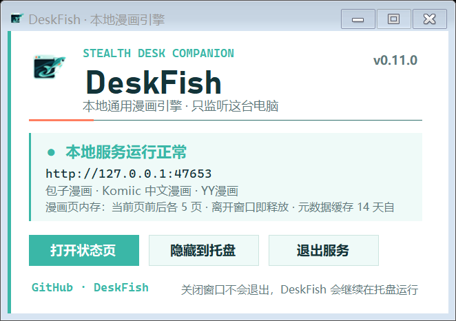
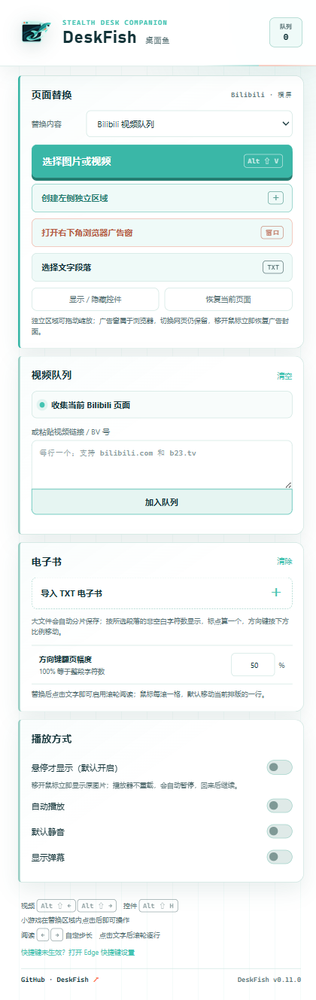

<p align="center">
  
</p>

<h1 align="center">DeskFish</h1>

<p align="center">把网页变成不显眼的播放器、漫画架、电子书和小游戏角落。</p>

<p align="center">
  <strong>简体中文</strong> · <a href="README_EN.md">English</a>
</p>

<p align="center">
  <a href="https://github.com/onguoin/DeskFish/releases/latest"></a>
  <a href="https://github.com/onguoin/DeskFish/releases"></a>
  
  
  <a href="LICENSE"></a>
</p>

DeskFish 是一条藏在浏览器边上的小鱼，也是给上班摸鱼、午休和办公室无聊时刻准备的 Edge 工具。它不假装提高生产力：你可以把网页里原有的图片或视频区域换成 Bilibili 视频、Bilibili/虎牙直播、桌面游戏窗口、小游戏、漫画，也可以把一段普通文字换成 TXT 电子书。

想要更自由一点时，还能直接在网页空白处创建一块内容区域，或者打开一个跨网页保留的浏览器级“老式传奇广告窗”。鼠标移开后，替换内容可以马上恢复成原网页；普通视频会暂停并保留进度，直播则在封面后持续播放，回来时不会断流。

> 请在不影响工作、遵守所在组织制度以及内容来源条款的前提下使用。DeskFish 不内置或转售影视、直播、漫画内容。

## 演示

<p align="center">
  <a href="https://github.com/onguoin/DeskFish/releases/download/v0.12.0/DeskFish-v0.12.0-demo.mp4">
    
  </a>
</p>

<p align="center">点击演示动图可查看高清 MP4 视频。</p>

## 功能

- **网页媒体替换**：选择图片或视频区域，替换为 Bilibili 视频、Bilibili/虎牙直播、漫画或小游戏。
- **桌面游戏窗口贴片**：把 Terraria、Minecraft、GTA V 等窗口化/无边框游戏拖进 `DeskFish.exe` 自动识别，再贴到网页图片区域；窗口保持真实可操作，移开鼠标立即恢复原图。
- **悬停伪装**：默认仅在鼠标悬停时显示替换内容；移开立即恢复原样，普通视频自动暂停，直播持续播放。
- **本地虎牙直播链路**：随包 EXE 解析公开房间、多 CDN 自动回退并在回环地址代理短时 HLS 分片，避免站外播放器的“试看结束”。
- **独立内容区域**：网页没有合适素材时，可以在左侧、右侧或浮动位置创建自己的区域。
- **浏览器广告窗**：独立于网页的右下角小窗，切换标签页也能保留；外观模拟老式页游广告，内部内容可替换。
- **全局快捷键**：不要求焦点停在播放器上，即可选择区域、切换上一条/下一条、隐藏控制栏或恢复页面。
- **小说与 TXT 电子书**：本地 TXT 流式分片并自动识别章节；支持章节跳转、固定字符数、百分比步进、方向键、点击后滚轮逐行阅读和进度记忆。
- **在线小说与公版书**：智能搜索会优先使用 EXE 内置的起点中文网公开章节解析器，也可在不运行 EXE 时直连 Project Gutenberg、中文维基文库和英文 Wikisource；选中的可读内容会缓存到本机。
- **漫画阅读**：本地 CBZ/ZIP/图片文件夹、MangaDex、Komga、Kavita、LANraragi、Suwayomi，以及随 Windows 程序提供的本地来源；可在来源原序与章节号升序之间切换。
- **连续阅读与缓存**：保存搜索、漫画、章节、页码和电子书进度；漫画页默认预取当前页前后各 5 页，离开窗口后释放内存。
- **自适应小游戏**：五子棋等小游戏会根据被替换区域自动缩放，小格子不会再塞入完整桌面布局。

## 界面

<p align="center">
  
</p>

<details>
  <summary>查看 Edge 扩展完整面板</summary>
  <p align="center"></p>
</details>

## 下载与安装

最新版本：[**下载 DeskFish for Windows x64**](https://github.com/onguoin/DeskFish/releases/latest/download/DeskFish-v0.13.0-Windows-x64.zip)

1. 解压下载的 ZIP，先运行 `DeskFish.exe`。它是自包含程序，不需要另装 Python、Node.js、Java、Docker 或 .NET。
2. 在 Edge 打开 `edge://extensions`，开启右上角“开发人员模式”。
3. 点击“加载解压缩的扩展”，选择压缩包中的 `edge-extension` 文件夹。
4. 建议把 DeskFish 固定到浏览器工具栏。使用本地漫画/小说、虎牙直播或桌面窗口贴片时，让 `DeskFish.exe` 留在托盘运行即可。

桌面游戏贴片要求游戏使用窗口化或无边框窗口模式。打开 `DeskFish.exe`，把游戏窗口拖到“窗口贴片”投放框内松开（也可从列表选择），再在扩展中选择“桌面游戏窗口”和网页图片区域。`Alt + Shift + G` 可随时紧急隐藏贴片并返回浏览器。

Windows 可能因为程序尚未购买代码签名证书而显示“未知发布者”。请只从本仓库的 Releases 下载，并可用 Release 页面提供的 SHA-256 校验压缩包。

## 版本更新内容

每个 GitHub Release 都会明确列出本次新增、改进、修复、使用方法、已知限制、升级步骤和安装包 SHA-256；仓库中的 [CHANGELOG.md](CHANGELOG.md) 保留全部中英文版本记录。发布说明格式见 [docs/RELEASING.md](docs/RELEASING.md)。

## 默认快捷键

| 操作 | 快捷键 |
| --- | --- |
| 选择要替换的图片或视频 | `Alt + Shift + V` |
| 下一条视频 / 下一页漫画 | `Alt + Shift + →` |
| 上一条视频 / 上一页漫画 | `Alt + Shift + ←` |
| 显示或隐藏视频控制栏 | `Alt + Shift + H` |
| 紧急隐藏桌面游戏贴片 | `Alt + Shift + G`（由 DeskFish.exe 注册） |

其余快捷键可以在 `edge://extensions/shortcuts` 中自行设置。电子书方向键和滚轮只在你点击过被替换文字后接管，避免影响网页正常滚动。

## 漫画来源

| 类型 | 支持情况 | 说明 |
| --- | --- | --- |
| 本地 CBZ / ZIP / 图片文件夹 | 内置 | 最稳定，数据不离开电脑 |
| MangaDex 官方 API | 内置 | 在线搜索与章节阅读 |
| Komga / Kavita / LANraragi | 内置连接 | 适合已有自建漫画库的人 |
| Suwayomi Server | 内置连接 | 支持 Suwayomi / Tachidesk OPDS API |
| DeskFish 本地引擎 | Windows 程序 | 当前包含包子漫画、Komiic 中文漫画、YY漫画 |

在线站点可能改版、限流或限制部分地区访问。连接器只在用户主动搜索或阅读时请求数据，漫画图片不会被打包进 DeskFish。请遵守内容来源的服务条款与版权规则。

## 小说来源

- 本地 TXT 支持 UTF-8 与 GB18030/GBK，导入时边读取边识别“第几章/回/卷”、序章、番外及英文 `Chapter` 标题；识别不到时保留为单章“全文”。章节只是额外的字符偏移索引，不影响原有分片与阅读进度。
- 在线小说内置三项无需 EXE 的免费官方接口：Project Gutenberg OPDS、中文维基文库 MediaWiki API、英文 Wikisource MediaWiki API。搜索后先查看章节列表，点选章节会把整本纯文本分片保存到 Edge 本地存储并定位过去，之后关闭弹窗或重启浏览器仍可直接续读。
- `DeskFish.exe` 新增起点中文网公开页面解析器，能搜索《斗罗大陆》等中文网络小说，严格保持官方目录顺序；官方标记为公开的章节可以下载缓存，订阅章节只显示目录和状态，不会绕过付费阅读。
- 小说来源默认使用“智能搜索”：中文关键词优先合并起点公开页面与中文维基文库结果，英文关键词优先使用 Gutenberg 与英文 Wikisource。也可在下拉框中固定某一个来源。
- EXE 中的 Project Gutenberg 连接器仍保留为本地磁盘缓存方案；所有本地解析逻辑都已编进 `DeskFish.exe`，不要求额外安装 Node、Python、Java、Legado 或浏览器插件。
- Windows 端采用独立的 `INovelSource` 接口，后续可继续加入有明确授权的 API 或站点适配器，而不需要修改网页阅读器。

## 数据、缓存与隐私

- 扩展设置、阅读记录和电子书内容保存在 Edge 扩展本地存储中。
- 本地漫画元数据和在线公版书正文缓存在 `%LOCALAPPDATA%\DeskFrame\manga-cache-v2`，超过 14 天自动清理；保留旧目录名是为了兼容早期版本的数据。
- 漫画图片使用窗口内存缓存，默认最多保留当前页前后各 5 页；离开阅读器会撤销 Blob URL 并释放缓存。
- Windows 本地服务只监听 `127.0.0.1:47653`，不会对局域网或公网开放端口。虎牙直播清单与分片只做短时回环代理，不写入磁盘缓存。
- 桌面窗口贴片只保存当前选择的窗口句柄，不录屏、不上传画面；释放贴片或退出 DeskFish 时会恢复窗口原有样式、位置和可见状态。

## 从源码构建

需要 Windows 10/11 与 .NET 10 SDK：

```powershell
./build.ps1
```

输出位于 `artifacts/DeskFish-v0.13.0-Windows-x64`。Edge 扩展本身无需编译，直接加载 `edge-extension` 文件夹即可。

## 项目结构

```text
DeskFish/
├─ edge-extension/   # Edge Manifest V3 扩展
├─ windows-host/     # 本地漫画/小说服务与托盘程序
├─ docs/             # Logo 与界面截图
└─ build.ps1         # Windows x64 打包脚本
```

## 许可证

DeskFish 以 [MIT License](LICENSE) 开源。第三方资源、依赖和内容连接器说明见 [THIRD_PARTY_NOTICES.md](THIRD_PARTY_NOTICES.md)。

项目作者：[@onguoin](https://github.com/onguoin)
